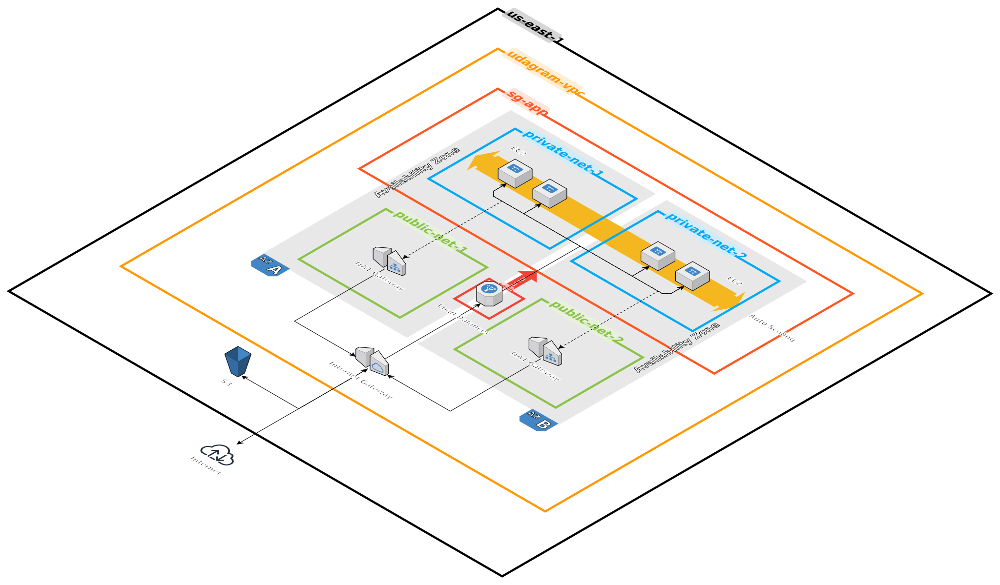

# CD12352 - Infrastructure as Code Project Solution
# Raul Herrera Marcos
## [Udagram](http://udagra-loadb-vafpvdp0byyh-448448295.us-east-1.elb.amazonaws.com)

## Infrastructure Diagram


The architecture, deployed in ```us-east-1```, contains a ```VPC``` which hosts two ```public``` and two ```private subnets``` across two ```AvailabilityZones```. 

The public subnets contain a ```NAT Gateway``` in order to enable communication from the private subnets to the Internet. The ```InternetGateway``` allows communication from the Internet to a ```LoadBalancer``` that distributes traffic to the ```EC2 instaces```, which are part of an ```AutoScalingGroup```.

Lastly, a ```S3 bucket``` allows the compute instances to access static resources.

## Considerations
These CloudFormation configuration files contain nested stacks, so the configuration parameters are embedded within them. For instance, the ```NetworkingStack``` parameters are:
```
  NetworkingStack:
    Type: AWS::CloudFormation::Stack
    Properties:
      TemplateURL: https://s3.us-east-1.amazonaws.com/cdo-c3.6-167029074152-bucket/network.yml
      Parameters:
        ProjectName: !Ref ProjectName
        VpcCidr: 10.0.0.0/16
        PublicSubnet1Cidr: 10.0.0.0/24
        PublicSubnet2Cidr: 10.0.1.0/24
        PrivateSubnet1Cidr: 10.0.2.0/24
        PrivateSubnet2Cidr: 10.0.3.0/24
```
As a consequence, the entire stack, including ```NetworkingStack```, ```StorageStack```, ```LoadBalancerStack``` and the compute elements, can be spun up or teared down together.

## Spin up instructions
```
aws cloudformation create-stack \
   --stack-name udagram \
   --template-body file://udagram.yml \
   --region us-east-1 \
   --capabilities CAPABILITY_NAMED_IAM
```

## Tear down instructions
```
aws cloudformation delete-stack \
   --stack-name udagram \
   --region us-east-1
```

## Potential improvements
It would be desirable to create a ```VPC Endpoint``` to access the ```S3 bucket``` from within the private subnets, without having to go through the costly ```NAT and Internet Gateways```.
